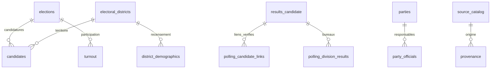

# Modèle relationnel

Périmètre initial : provincial Québec. Les préfixes `qc-prov-` rendent possible une extension distincte à d'autres niveaux.

Une élection générale ou un ensemble officiel d'élections partielles le même jour constitue un événement. La date et le type composent l'identifiant; chaque circonscription partielle demeure distincte dans les tables enfants. Le numéro administratif d'une candidature ne désigne pas nécessairement une personne à travers le temps. `candidate_id` inclut donc élection, circonscription et numéro source. Aucun rapprochement nominatif n'est effectué.

`district_id` inclut l'année de la carte, l'édition des codes et le code officiel. La carte 2017 et son édition 2022 portent des noms/codes différents : une correspondance doit être vérifiée avant comparaison. On ne fusionne pas par nom. La relation spatiale 2017/2026 est une intersection de géométries, sans réallocation des votes et sans estimation de population.

`party_id` dans les résultats est un identifiant administratif contextualisé par élection. Le REPAQ contient des identifiants courants et anciens; une table d'alias explicites permet une future correspondance, sans supposer que tous les anciens numéros sont permanents.

Les fichiers publics de résultats exposent les mesures sources et les indicateurs descriptifs. `isResultatsFinaux` commande seul le statut final. Une avance dans un fichier préliminaire n'est pas une personne élue. Le champ provincial `tauxParticipationTotal` est décrit par le producteur comme une extrapolation pendant le dépouillement : il reste dans les champs sources et n'est jamais présenté comme participation observée.

Chaque observation contient `source_id`, `snapshot_id`, `observed_at`, `retrieved_at`, `source_updated_at`, `data_status`. `observed_at` est l'instant de consultation, pas la date du fait. Une date source absente reste manquante. Les octets téléchargés sont adressés par SHA-256; les journaux permettent de retrouver les captures successives même si les octets sont identiques. La reconstruction est déterministe à partir de ces captures.

Tables opérationnelles : élections, circonscriptions, candidatures, résultats candidats/partis/circonscriptions, inscrits, participation, bureaux et modalités, géométries, responsables, autorisations et alias de partis. Tables locales selon droits : démographie, statistiques agrégées des candidatures, historique supplémentaire et finances. Le calendrier est une transcription du PDF effectivement référencé sur dgeq.org. Les autres tables attendent une source ou une extraction vérifiée; elles figurent au catalogue avec un statut explicite et ne sont pas remplies artificiellement.

## Relations conditionnelles

La clé primaire inclut `snapshot_id` lorsqu’une table conserve plusieurs consultations. Pour une analyse courante, le lecteur `R/read_tables.R` sélectionne la dernière consultation par source et événement. Les jointures de captures doivent toujours contrôler cette dimension.

Les données financières gardent les noms officiels et le périmètre comptable, sans rapprochement forcé avec les identifiants REPAQ. Les historiques JSON supplémentaires utilisent l’abréviation politique dans l’événement et la position de candidature dans le fichier lorsque les codes administratifs sont absents. Ces identifiants dérivés ne sont pas des codes du producteur.

Avant 1948, l’année de carte reste manquante dans ce lecteur, faute d’attribution vérifiée. L’édition de nomenclature historique contient l’année du scrutin afin d’éviter une fusion involontaire des codes. Les modalités de vote ne sont pas attribuées à partir d’un numéro de bureau.

`polling_candidate_links` décrit les appariements exacts et les en-têtes sans correspondance. Seuls les liens exacts peuvent être utilisés comme clé étrangère vers un résultat de candidature. Le registre des partis et les affiliations dans les archives constituent deux espaces d’identifiants distincts.
